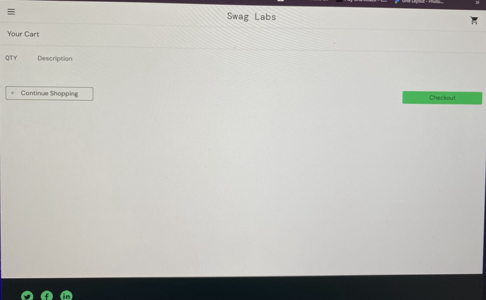
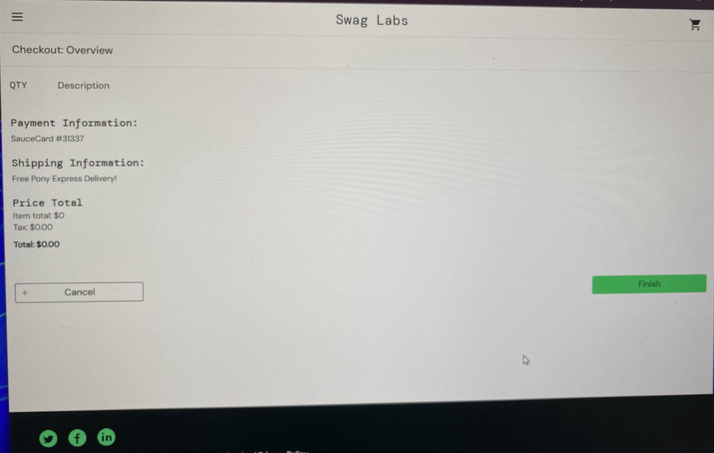
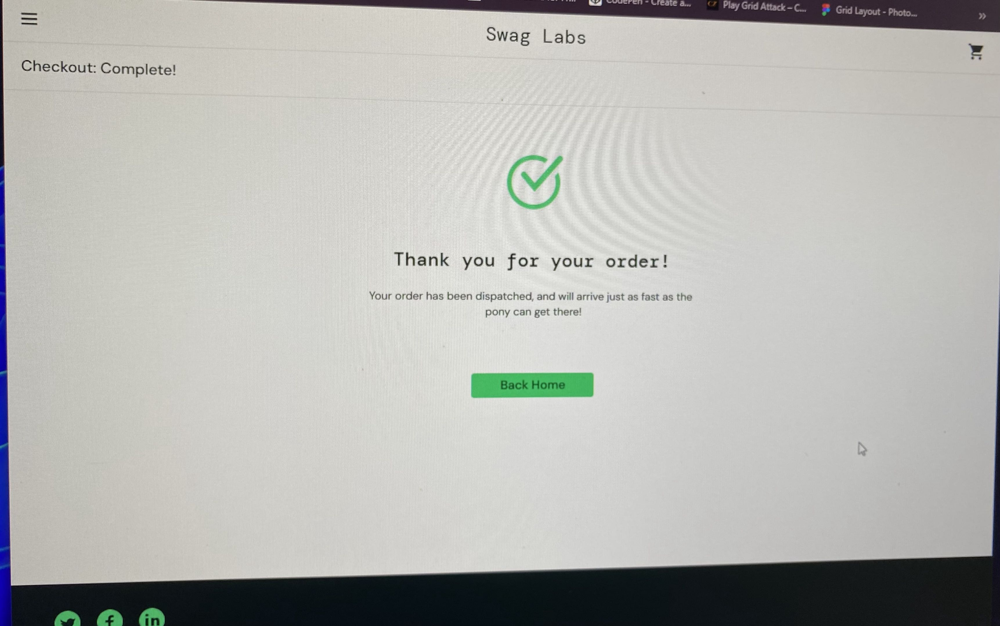

# BUG-001 — User can complete checkout with an empty shopping cart

**Bug ID:** BUG-001

**Title:** User can complete an order with an empty shopping cart for $0.00

**Environment:**

* Website: SauceDemo
* User: `standard_user`
* Browser: Google Chrome
* Operating System: Windows

**Preconditions:**

* User is logged in with a valid `standard_user` account.
* At least one product is available on the Products page.

**Steps to Reproduce:**

1. Log in to SauceDemo using the `standard_user` account.
2. Add any product to the shopping cart.
3. Open the shopping cart.
4. Remove the product from the cart.
5. Verify that the shopping cart is empty.
6. Click the **Checkout** button.
7. Enter valid checkout information.
8. Click **Continue**.
9. Click the **Finish** button.

**Expected Result:**
The system should prevent the user from proceeding with the checkout process when the shopping cart is empty. The user should be informed that at least one product must be added to the cart before completing an order.

**Actual Result:**
The user is able to proceed through the checkout process with an empty shopping cart and successfully complete the order with a total of **$0.00**. The order confirmation page is displayed.

**Severity:** Medium

**Priority:** Medium

**Status:** Open

**Evidence:**

### 1. Empty Shopping Cart

### 2. Checkout with $0.00 Total

### 3. Order Confirmation
